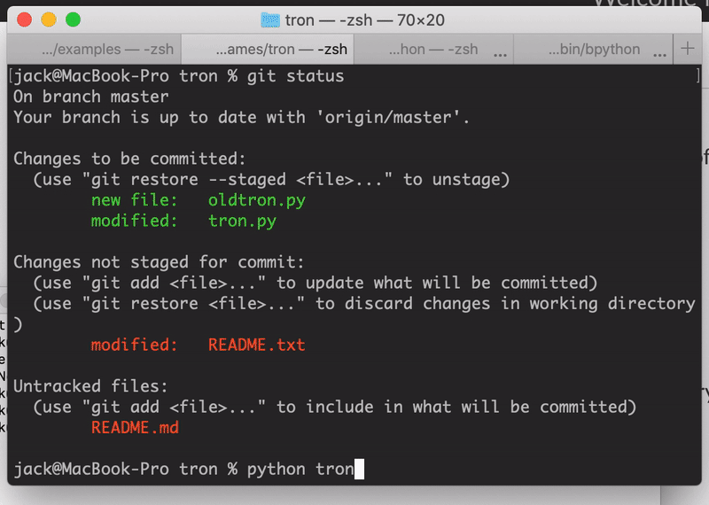

tron.py a two player, one keyboard, **command line** clone of the classic arcade game TRON, built using [curtsies](https://github.com/bpython/curtsies).

**Changelog**
January 2019 - Created for intro CS using Zelle's graphics library, graphics.py
June 2020 - Created command line version to help familiarize myself with curtsies library. Old version is preserved as oldtron.py

